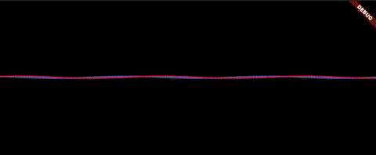

# Ocean Protocol Waves


The Ocean Protocol Waves, created and designed entirely in dart / flutter code.

```
class OceanProtocolWavesTest extends StatelessWidget {
  const OceanProtocolWavesTest({super.key});

  @override
  Widget build(BuildContext context) {
    return Padding(
      padding: const EdgeInsets.only(top: 32),
      child: const OceanProtocolWaves(),
    );
  }
}
```
